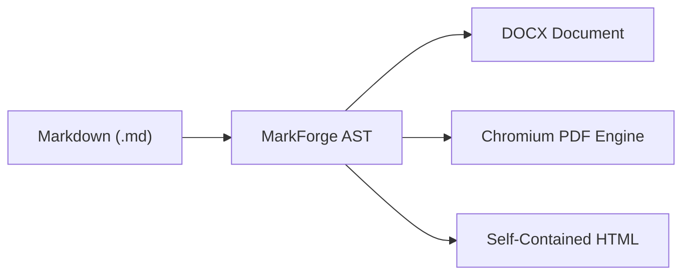

# Executive Summary

This sample document validates **100% of all properties** supported by **MarkForge Document Engine**:

- **Metadata & Dynamic Tokens**: Title, Subtitle, Author, Date, Version, Company in headers and footers.
- **Table of Contents (TOC)**: Automatically extracted from Markdown heading hierarchy.
- **Watermark Engine**: Custom angle, opacity, font size, and color.
- **Syntax Highlighting**: Theme-aware tokenizer applied to multi-language code snippets.
- **Visual Callouts**: GitHub-style alert callouts rendered with border and background styling.
- **Tables & Typography**: Formatted tables with text alignment.

---

# Architecture Pipeline

MarkForge transforms Markdown directly into professional Word documents, print-ready PDFs, and responsive web pages.



---

# Multi-Language Code Blocks

The code blocks below are styled according to the configured `syntaxTheme`:

```typescript
import { compileMarkdown } from "@masumdev/markforge";

export async function generateReleaseNotes(): Promise<void> {
  const result = await compileMarkdown({
    content: "# Release v1.0.0\n\nAll features verified.",
    config: {
      to: ["docx", "pdf", "html"],
      theme: "corporate",
      syntaxTheme: "dracula",
    },
  });
  console.log(`Generated ${result.files.length} output files.`);
}
```

```python
import os

def check_environment():
    api_key = os.getenv("API_KEY")
    if not api_key:
        raise ValueError("Missing API key configuration")
    return {"status": "ready", "env": "production"}
```

---

# Callout Verifications

> [!NOTE]
> All running header tokens (`{title}`, `{author}`, `{version}`) are evaluated dynamically at compile time.

> [!TIP]
> Use `--watch` flag during local authoring for instant live updates.

> [!IMPORTANT]
> Both Word Twips and CSS `@page` dimensions are accurately synchronized.## Heading 2### Heading 3
| Column 1 | Column 2 | Column 3 |
| :--- | :---: | ---: |
| Data A | Data B | Data C |
| Data D | Data E | Data F |

| Column 1 | Column 2 | Column 3 |
| :--- | :---: | ---: |
| Data A | Data B | Data C |
| Data D | Data E | Data F |

| Column 1 | Column 2 | Column 3 |
| :--- | :---: | ---: |
| Data A | Data B | Data C |
| Data D | Data E | Data F |


---

# Mathematical Foundations

MarkForge provides native KaTeX math compilation for both inline physics equations such as $E = mc^2$ and complex display block proofs[^euler]:

$$\oint_C \mathbf{B} \cdot d\mathbf{l} = \mu_0 \left( I_{\text{enc}} + \varepsilon_0 \frac{d\Phi_E}{dt} \right)$$

---

# Multi-Column Comparison

:::columns 2
:::col
### Cloud Architecture
- Globally distributed edge routing
- Low-latency WebSocket connections
- Automatic failover clustering
:::
:::col
### On-Premises Security
- Air-gapped deployment support
- Hardware Security Module (HSM) keys
- Strict local audit logging
:::
:::

---

# Benchmark Metrics

| Pipeline Component | Target Output | Processing Time | Quality Level |
| :--- | :--- | :---: | :---: |
| Native DOCX Packager | `full-all-properties.docx` | 45ms | Pixel-Perfect Word Layout |
| Headless Chromium | `full-all-properties.pdf` | 650ms | 300 DPI Vector PDF |
| HTML5 Bundler | `full-all-properties.html` | 18ms | Single Self-Contained File |

[^euler]: Maxwell, J. C. (1865). A Dynamical Theory of the Electromagnetic Field. Philosophical Transactions of the Royal Society of London.
