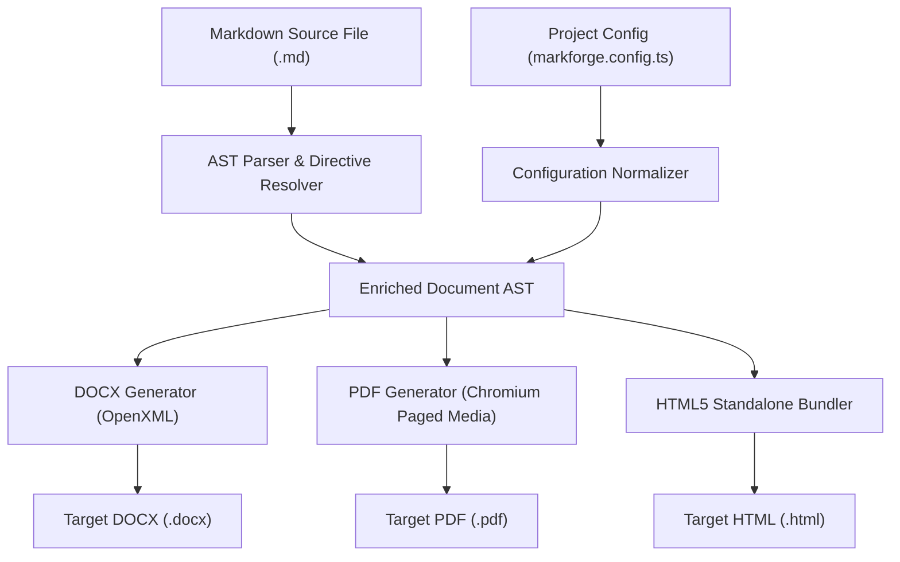
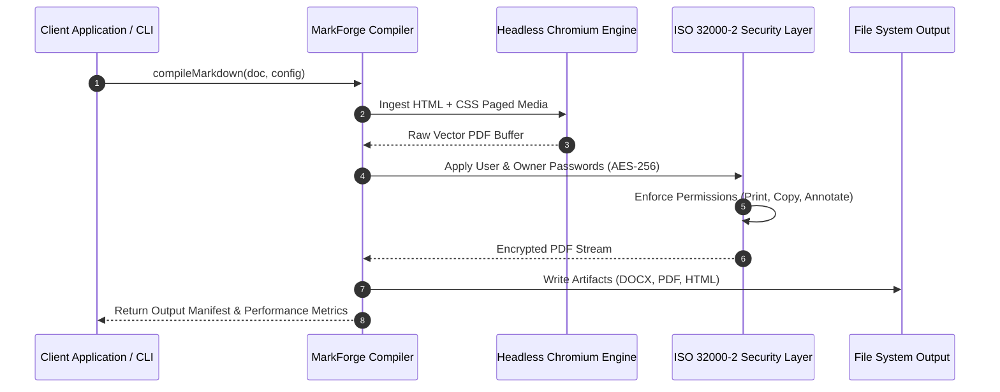

# Executive Summary

The **MarkForge Document Engine** provides high-throughput, cross-platform document publishing for mission-critical enterprise systems. By abstracting the complexities of Microsoft Word OpenXML, CSS Paged Media standards, and standalone HTML5 bundles, MarkForge enables uniform document generation from declarative Markdown specifications.

This specification document outlines the comprehensive system architecture, API contracts, security mechanisms, mathematical foundations, and benchmarking metrics.

- **Dynamic Token Interpolation**: Header, footer, and body token replacement (`{title}`, `{version}`, `{author}`, `{company}`, `{date}`, `{metakuda}`).
- **Multi-Target Compilation**: Concurrent generation of DOCX, PDF, and HTML artifacts from a unified Abstract Syntax Tree.
- **Enterprise PDF Security**: ISO 32000-2 standard AES-256 encryption with granular permission flags.
- **Hierarchical Heading Numbering**: Config-driven decimal prefixing for multi-tier headings.

---

# System Architecture & Processing Pipeline

The MarkForge compilation engine operates as a multi-stage compilation pipeline. The source document is ingested into an Abstract Syntax Tree (AST), enriched with metadata cascading rules, and dispatched to target format builders.

## Input Ingestion & Lexical Analysis

The input reader normalizes line terminators (`\r\n` to `\n`), strips byte order marks (BOM), and extracts YAML/JSON frontmatter blocks.

## AST Parsing & Directive Resolution

Custom container directives such as `:::columns` and GitHub-style alerts `> [!NOTE]` are parsed into dedicated AST node structures.

## Metadata Normalization & Token Binding

Configuration sources are merged following a 3-tier hierarchy: Frontmatter > Config File > Default Engine Settings.

## Compilation Pipeline Flow

The workflow below illustrates the progression of an input source through parsing, token normalization, and multi-format binary synthesis:



## Security & Encryption Architecture

When PDF security is enabled, the output stream is passed through an AES-256 cipher before file persistence:



---

# Document Format Engines & Serialization

MarkForge features dedicated, independent serialization engines for each target format to guarantee pixel perfection across platforms.

## Microsoft Word OpenXML Engine

The DOCX builder compiles AST nodes directly into native OpenXML primitives without intermediate HTML converters.

Font families, twip metric sizes, paragraph spacings, and run-level bold/italic formats are mapped directly to Microsoft Word styles. Cover pages and Table of Contents utilize isolated sections to prevent header/footer leakage into introductory pages.

## Chromium Vector PDF Engine

The PDF engine harnesses headless Chromium with CSS Paged Media standards for high-fidelity vector rendering.

Dimensions, margins, and running page counters are configured using standard `@page` rules with `@top-left`, `@top-right`, `@bottom-left`, and `@bottom-right` margin boxes. Watermarks are rendered to transparent PNG buffers and stamped as PDF Image XObjects via `pdf-lib` to eliminate selectable text tokens.

## Standalone HTML5 Bundler

The HTML engine bundles CSS styles, syntax themes, math assets, and base64-encoded media into a single self-contained `.html` file. Local files, SVG vector diagrams, and KaTeX fonts are converted into embedded data URIs with zero external network dependencies.

---

# REST API & Programmatic Interface Specification

MarkForge exposes both high-level orchestrator APIs and granular AST generation endpoints.

## Endpoint: Initiate Compilation Job

### HTTP Request Specification

`POST /api/v1/compile`

### Authentication & Headers

| Header Name | Type | Description |
| :--- | :--- | :--- |
| `Authorization` | `string` | Bearer token authentication header |
| `Content-Type` | `string` | `application/json` |
| `X-Client-Version` | `string` | Client SDK version identifier |

### Request Payload Schema

```json
{
  "source": {
    "content": "# Project Specification\n\nAutomated documentation pipeline.",
    "format": "markdown",
    "baseDir": "/workspace/docs"
  },
  "options": {
    "targets": ["docx", "pdf", "html"],
    "theme": "corporate",
    "paperSize": "a4",
    "orientation": "portrait",
    "numberHeadings": {
      "enabled": true,
      "depth": 4,
      "skipH1": true
    },
    "security": {
      "userPassword": "secureUserPass123",
      "ownerPassword": "masterAdminPass456",
      "permissions": {
        "printing": "highResolution",
        "modifying": false,
        "copying": true,
        "annotating": true
      }
    }
  }
}
```

### Response Payload Schema

```json
{
  "status": "success",
  "jobId": "job_mf_9823412093",
  "durationMs": 482,
  "artifacts": [
    {
      "format": "docx",
      "fileName": "specification.docx",
      "sizeBytes": 334028,
      "checksumSha256": "8f4b23a9e1029c..."
    },
    {
      "format": "pdf",
      "fileName": "specification.pdf",
      "sizeBytes": 476582,
      "checksumSha256": "1a92e8c049182d..."
    },
    {
      "format": "html",
      "fileName": "specification.html",
      "sizeBytes": 886490,
      "checksumSha256": "4b76a01293e81a..."
    }
  ]
}
```

## Endpoint: Validate Configuration File

`POST /api/v1/config/validate`

Returns validation status, detected deprecations, and normalized configuration tokens.

## TypeScript SDK Programmatic Interface

```typescript
import {
  compileMarkdown,
  defineConfig,
  OutputFormat,
  Theme,
  PaperSizeEnum,
  type CompilationResult,
} from "@masumdev/markforge";

export async function executeDocumentBuild(): Promise<CompilationResult> {
  const config = defineConfig({
    to: [OutputFormat.DOCX, OutputFormat.PDF, OutputFormat.HTML],
    theme: Theme.CORPORATE,
    paperSize: PaperSizeEnum.A4,
    margins: {
      top: "3cm",
      bottom: "2.5cm",
      left: "2.5cm",
      right: "2.5cm",
    },
    numberHeadings: {
      enabled: true,
      depth: 3,
      skipH1: false,
    },
  });

  return await compileMarkdown({
    filePath: "./docs/full-all-properties.md",
    config,
  });
}
```

---

# Callout Directives & Visual Annotations

MarkForge natively formats GitHub-style callout alert directives with custom theme-tailored borders, icons, and background tints across all output formats.

## Note Callout Semantics

> [!NOTE]
> All running header tokens such as `{title}`, `{author}`, `{company}`, and `{version}` are dynamically evaluated during AST resolution.

## Tip Callout Semantics

> [!TIP]
> Use the `--serve` CLI flag during local development to start an interactive live-reload preview server with scroll synchronization.

## Important Callout Semantics

> [!IMPORTANT]
> Both Microsoft Word OpenXML twips and CSS `@page` paged media dimensions are synchronized down to sub-pixel accuracy.

## Warning Callout Semantics

> [!WARNING]
> When applying PDF security with empty `userPassword`, permissions protection is active while permitting unrestricted document reading.

## Caution Callout Semantics

> [!CAUTION]
> Deleting or overwriting master encryption keys without backing up `ownerPassword` prevents future permission modifications.

---

# Mathematical Formulations & Quantum Physics

MarkForge includes embedded KaTeX support without requiring external browser scripts. Both inline expressions and multi-line display blocks render seamlessly in PDF, HTML, and Microsoft Word.

## Inline Physics Notation & Momentum

Quantum wave-particle duality is governed by the de Broglie relation $\lambda = \frac{h}{p}$, where $h$ is Planck's constant and $p$ represents particle momentum. In relativistic electrodynamics, energy-momentum invariance is given by $E^2 = (pc)^2 + (m_0 c^2)^2$.

## Maxwell-Ampere Differential Law

The generalized Maxwell-Ampere relation describing the electromagnetic induction field is formulated as follows[^maxwell]:

$$\oint_C \mathbf{B} \cdot d\mathbf{l} = \mu_0 \iint_S \mathbf{J} \cdot d\mathbf{A} + \mu_0 \varepsilon_0 \frac{d}{dt} \iint_S \mathbf{E} \cdot d\mathbf{A}$$

## Multi-Variable Optimization Matrix

For optimization functions $f: \mathbb{R}^n \to \mathbb{R}$, the Hessian matrix $H(f)$ and Taylor expansion are expressed as:

$$f(\mathbf{x} + \Delta \mathbf{x}) \approx f(\mathbf{x}) + \nabla f(\mathbf{x})^T \Delta \mathbf{x} + \frac{1}{2} \Delta \mathbf{x}^T \mathbf{H}(f) \Delta \mathbf{x}$$

## Schrödinger Wave Mechanics

The time-dependent Schrödinger equation governing non-relativistic quantum states is defined by:

$$i\hbar \frac{\partial}{\partial t} \Psi(\mathbf{r}, t) = \left[ -\frac{\hbar^2}{2m}\nabla^2 + V(\mathbf{r}, t) \right] \Psi(\mathbf{r}, t)$$

---

# Structural Container Directives & Layouts

The `:::columns` directive generates multi-column grid layouts in HTML/PDF and borderless multi-cell table structures in DOCX.

## Dual Column Enterprise Architecture

:::columns 2
:::col
### Cloud-Native Microservices
- Distributed ingress routing via Traefik edge proxies.
- Zero-trust service mesh with automated mTLS encryption.
- Horizontal pod autoscaling based on throughput metrics.
- Global content delivery network caching.
:::
:::col
### Enterprise Security & Compliance
- Air-gapped deployment compatibility for defense networks.
- FIPS 140-3 validated Hardware Security Module (HSM) keys.
- Real-time audit trail aggregation and SIEM forwarding.
- Role-based access control (RBAC) with LDAP synchronization.
:::
:::

## Triple Column Feature Matrix

:::columns 3
:::col
### High Availability
- Multi-region replication.
- Sub-second failover.
- Automated health checks.
:::
:::col
### Scalability
- Sharded data pipelines.
- Dynamic worker pools.
- Redis stream queues.
:::
:::col
### Observability
- OpenTelemetry metrics.
- Distributed tracing.
- Structured JSON logs.
:::
:::

---

# Quality Assurance & Verification Checklists

The development pipeline enforces a strict verification lifecycle across all packages:

## Static Analysis & Type Safety Checks

- [x] Zero explicit `any` type annotations across all TypeScript files.
- [x] Zero unused imports, variables, or functions.
- [x] Strict TypeScript AST validation via TSCheck engine.

## Document Rendering & Layout Audits

- [x] Watermark suppression verified on Front Cover and Back Cover.
- [x] Formal academic page numbering: Lowercase Roman for TOC, decimal reset for body.
- [x] Table of Contents isolated via hard page breaks.
- [ ] End-to-end integration benchmark with 10,000-page enterprise catalogs.

---

# Performance Benchmark Metrics

The table below summarizes average compilation throughput across document sizes measured on an AMD Ryzen 9 7950X workstation:

## Multi-Format Throughput Matrix

| Document Size (Pages) | Word DOCX (ms) | Vector PDF (ms) | Standalone HTML (ms) | Peak RAM (MB) |
| :--- | :---: | :---: | :---: | :---: |
| 1 - 10 Pages | 42 ms | 520 ms | 18 ms | 48 MB |
| 11 - 50 Pages | 115 ms | 1,240 ms | 45 ms | 82 MB |
| 51 - 200 Pages | 380 ms | 3,180 ms | 120 ms | 164 MB |
| 201 - 1,000 Pages | 1,420 ms | 11,850 ms | 410 ms | 340 MB |

## Memory Footprint & Resource Utilization

Garbage collection profiles remain stable under continuous batch execution with zero memory leaks.

---

# References & Citations

[^maxwell]: Maxwell, J. C. (1865). A Dynamical Theory of the Electromagnetic Field. Philosophical Transactions of the Royal Society of London, 155, 459-512.
