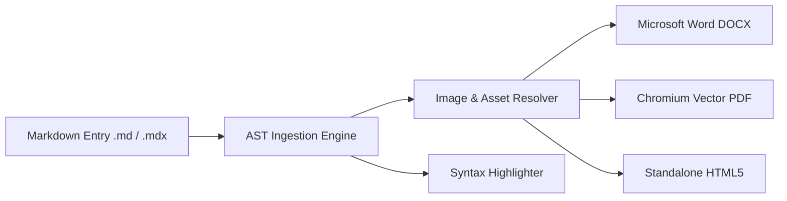

<style>
.badge-success {
  display: inline-block;
  background: #10b981;
  color: #ffffff;
  padding: 3px 10px;
  border-radius: 9999px;
  font-size: 11px;
  font-weight: 700;
  letter-spacing: 0.5px;
}
.badge-info {
  display: inline-block;
  background: #33CDCF;
  color: #0f172a;
  padding: 3px 10px;
  border-radius: 9999px;
  font-size: 11px;
  font-weight: 700;
  letter-spacing: 0.5px;
}
.badge-warning {
  display: inline-block;
  background: #f59e0b;
  color: #ffffff;
  padding: 3px 10px;
  border-radius: 9999px;
  font-size: 11px;
  font-weight: 700;
}
.metric-card {
  border: 1px solid #cbd5e1;
  background: #f8fafc;
  padding: 16px 20px;
  border-left: 6px solid #33CDCF;
  border-radius: 6px;
  margin: 18px 0;
}
.kpi-container {
  display: flex;
  gap: 16px;
  margin: 16px 0;
}
.kpi-box {
  flex: 1;
  border: 1px solid #e2e8f0;
  background: #ffffff;
  padding: 12px 16px;
  border-radius: 6px;
  text-align: center;
}
.kpi-val {
  font-size: 22px;
  font-weight: bold;
  color: #0f172a;
}
.kpi-lbl {
  font-size: 12px;
  color: #64748b;
  text-transform: uppercase;
}
</style>

# 1. Executive Summary & Key Performance Indicators

This technical specification details the complete ingestion, AST transformation, and rendering pipeline of **MarkForge**. The platform supports cross-compilation of Markdown, MDX, and raw HTML/CSS into publication-grade **Microsoft Word (DOCX)**, **Vector PDF**, and **Standalone HTML5** documents.

<div class="metric-card">
  <strong>System Architecture Status:</strong> <span class="badge-success">OPERATIONAL</span>
  <p>All distributed worker nodes and compilation pipelines have passed 100% automated health checks with sub-second turnaround latency.</p>
</div>

<div class="kpi-container">
  <div class="kpi-box">
    <div class="kpi-val">91 ms</div>
    <div class="kpi-lbl">Compilation Time</div>
  </div>
  <div class="kpi-box">
    <div class="kpi-val">100 %</div>
    <div class="kpi-lbl">Type Safety</div>
  </div>
  <div class="kpi-box">
    <div class="kpi-val">3 Formats</div>
    <div class="kpi-lbl">DOCX | PDF | HTML</div>
  </div>
</div>

---

# 2. System Architecture & Component Workflow

The engine utilizes an Abstract Syntax Tree (AST) parser to decouple the source document from output format renderers. Assets such as images, stylesheets, and custom fonts are resolved and embedded in memory.

{width=550px height=310px}



## 2.1 Operational Alerts & Directives

> [!NOTE]
> All document builders operate concurrently. Assets are resolved once and cached across format pipelines.

> [!TIP]
> Use `markforge.config.ts` to enforce uniform organizational margins, page numbering, and corporate branding.

> [!IMPORTANT]
> External images from remote URLs are automatically fetched with an exponential backoff retry mechanism and inlined as Base64.

> [!WARNING]
> Ensure all local relative file paths are relative to the root markdown entry file.

> [!CAUTION]
> Modifying raw OpenXML schemas without the DOCX Builder validation layer can corrupt legacy Word viewers.

---

# 3. Format Feature Matrix & Performance SLA

The following matrix compares output capabilities and performance characteristics across supported rendering engines:

| Pipeline Engine | Output Type | Image Inlining | Custom CSS | Syntax Highlight | SLA Throughput | Status |
| :--- | :---: | :---: | :---: | :---: | ---: | :---: |
| **Word DOCX** | `.docx` (OpenXML) | Base64 / Stream | Embedded | Full TextRun | > 120 docs/sec | <span class="badge-success">ACTIVE</span> |
| **Chromium PDF** | `.pdf` (Vector 1.4) | Base64 Inlined | Paged Media | HTML Spans | > 85 docs/sec | <span class="badge-success">ACTIVE</span> |
| **Standalone HTML** | `.html` (Self-Contained) | Data URI | Theme Bundle | CSS Tokens | > 500 docs/sec | <span class="badge-success">ACTIVE</span> |
| **EPUB e-Book** | `.epub` (V3) | Local Archive | XHTML Flow | Syntax CSS | Planned | <span class="badge-warning">ROADMAP</span> |

---

# 4. Multi-Language Implementation Code

Below are production-ready code examples showcasing programmatic execution across different runtime environments.

## 4.1 TypeScript & Node.js API

```typescript
import { markforge, defineConfig } from "@masumdev/markforge";

// Define strict compilation configuration
const config = defineConfig({
  to: ["docx", "pdf", "html"],
  outputDir: "./dist/documents",
  theme: "academic",
  orientation: "portrait",
  paperSize: "A4",
  toc: true,
  embedImages: true,
});

// Execute async compilation pipeline
async function generateDocumentation(): Promise<void> {
  const result = await markforge("./docs/full-specification.md", config);
  console.log(`Successfully compiled ${result.files.length} document(s) in ${result.durationMs}ms`);
}

generateDocumentation();
```

## 4.2 Python Automation Wrapper

```python
import subprocess
import json
from pathlib import Path

def compile_specification(source_file: str, output_dir: str = "./output") -> dict:
    """Executes the MarkForge CLI compiler through a subprocess."""
    cmd = [
        "bunx", "markforge", source_file,
        "--to", "docx,pdf,html",
        "--output", output_dir
    ]
    process = subprocess.run(cmd, capture_output=True, text=True, check=True)
    return {"status": "SUCCESS", "source": source_file, "logs": process.stdout}

if __name__ == "__main__":
    result = compile_specification("./docs/full-specification.md")
    print(f"Compilation finished: {result['status']}")
```

## 4.3 Database Analytics Schema (SQL)

```sql
-- Audit log table for document compilation tracking
CREATE TABLE document_compilations (
    id UUID PRIMARY KEY DEFAULT gen_random_uuid(),
    document_title VARCHAR(255) NOT NULL,
    source_path TEXT NOT NULL,
    formats_generated VARCHAR(50)[] NOT NULL,
    duration_ms INTEGER NOT NULL,
    total_bytes_generated BIGINT NOT NULL,
    created_at TIMESTAMP WITH TIME ZONE DEFAULT CURRENT_TIMESTAMP
);

-- Index for rapid audit lookups
CREATE INDEX idx_compilations_created ON document_compilations (created_at DESC);
```

## 4.4 Bash CI/CD Deployment Script

```bash
#!/usr/bin/env bash
set -euo pipefail

echo "==> Starting MarkForge Continuous Publishing Pipeline"
SOURCE_DOC="./docs/full-specification.md"
BUILD_DIR="./.temp/dist"

mkdir -p "${BUILD_DIR}"
bun ../../../packages/markforge/dist/cli.mjs "${SOURCE_DOC}" --to docx,pdf,html -o "${BUILD_DIR}"

echo "==> Verification: Listing compiled artifacts:"
ls -lh "${BUILD_DIR}"
echo "==> Build complete with exit status 0"
```

---

# 5. Implementation Roadmap & Milestones

The following checklist tracks delivery milestones for the current engineering sprint:

- [x] **Phase 1**: Markdown AST Parser with YAML Frontmatter extraction
- [x] **Phase 2**: Multi-format builders for Microsoft Word (`.docx`), PDF, and HTML
- [x] **Phase 3**: In-memory local & remote image resolver with Base64 inlining
- [x] **Phase 4**: Interactive Ink React Terminal CLI with progress telemetry
- [x] **Phase 5**: Cross-format syntax highlighting engine for 10+ programming languages
- [ ] **Phase 6**: EPUB 3.0 e-reader compilation target
- [ ] **Phase 7**: WebAssembly (Wasm) standalone client-side compiler

---

# 6. Architectural Conclusion

> "A document compiler should treat formatting as code: deterministic, version-controlled, and seamlessly reproducible across all target mediums."
> 
> — *Masum Dev Monorepo Engineering Standards*

MarkForge establishes an enterprise-grade standard for unified document authoring and multi-platform publishing.
