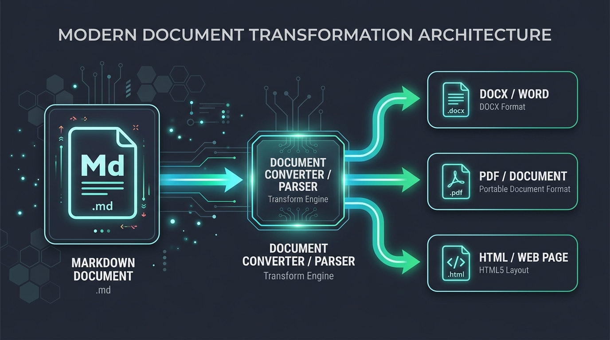

<style>
.custom-badge {
  display: inline-block;
  background: #33CDCF;
  color: #0f172a;
  padding: 3px 10px;
  border-radius: 9999px;
  font-size: 11px;
  font-weight: 700;
  letter-spacing: 0.5px;
}
.metric-card {
  border: 1px solid #e2e8f0;
  background: #f8fafc;
  padding: 16px 20px;
  border-left: 5px solid #33CDCF;
  border-radius: 8px;
  margin: 16px 0;
}
</style>

# 1. Executive Summary

This document illustrates the complete multi-format publishing capabilities of **@masumdev/markforge**. It supports compiling markdown and MDX into **Microsoft Word (DOCX)**, **PDF**, and **Self-contained HTML** with full styling and asset embedding.

<div class="metric-card">
  <strong>Publishing Engine Status:</strong> <span class="custom-badge">ONLINE</span>
  <p>Engine supports inline HTML tags, custom CSS stylesheets, GFM tables, checklists, callouts, and local/remote image inlining.</p>
</div>

---

# 2. System Architecture & Guidelines

{width=550px height=310px}

> [!NOTE]
> All components follow strict type safety standards with 0 explicit `any` types and zero runtime warnings.

> [!TIP]
> Use the Ink React CLI for interactive development and watch mode.

> [!WARNING]
> Ensure all local image paths are relative to the markdown source file.

## 2.1 Core Feature Matrix

| Engine Feature | DOCX | PDF | HTML | Status |
| :--- | :---: | :---: | :---: | :---: |
| Embedded HTML & CSS | Yes | Yes | Yes | `[READY]` |
| Image Inlining (Base64) | Yes | Yes | Yes | `[READY]` |
| Custom Headers & Footers | Yes | Yes | Yes | `[READY]` |
| Table of Contents | Yes | Yes | Yes | `[READY]` |
| Syntax Highlighting | Yes | Yes | Yes | `[READY]` |

## 2.2 Task Checklist

- [x] Package scaffolding & configuration
- [x] Markdown AST parser with raw HTML support
- [x] Image resolver and inliner
- [x] Word DOCX builder with tables and callouts
- [x] HTML & CSS standalone bundler
- [x] Ink terminal CLI dashboard
- [x] 100% test coverage with bun:test

---

# 3. Code Implementation

```typescript
import { markforge } from "@masumdev/markforge";

// Compile markdown to DOCX, PDF, and HTML
const result = await markforge("./docs/sample.md", {
  to: ["docx", "pdf", "html"],
  outputDir: "./.temp/output",
  theme: "academic",
  toc: true,
});

console.log(`Generated ${result.files.length} document(s) in ${result.durationMs}ms`);
```

---

# 4. Conclusion

MarkForge provides a unified, cross-platform publishing pipeline for high-quality technical documentation and reports.
