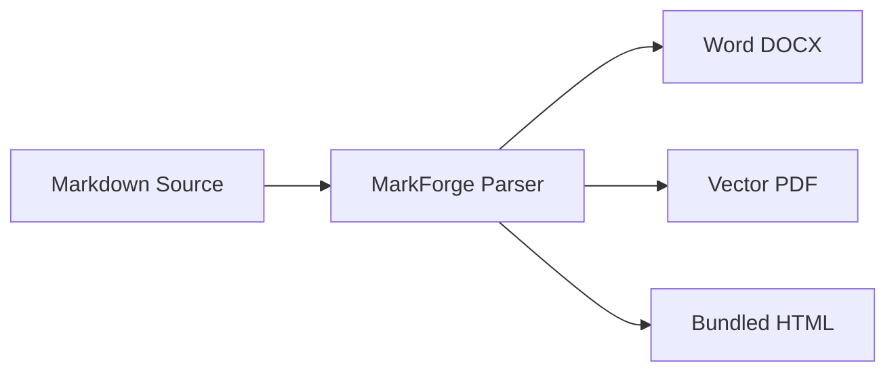

import { Card, CardGrid } from '@astrojs/starlight/components';

**MarkForge** is an enterprise-grade Markdown & MDX document publishing engine and CLI. It compiles a single Markdown source into pixel-perfect **Microsoft Word (DOCX)**, **PDF**, and **standalone HTML** — with native Mermaid diagrams, GitHub-style callout alert boxes, dual-theme syntax highlighting, customizable `ThemeProps`, per-zone header/footer slots, and an interactive Ink terminal UI.

<CardGrid>
  <Card title="📄 Multi-Format Output" icon="document">
    Generate `.docx`, `.pdf`, and `.html` simultaneously from a single Markdown source.
  </Card>
  <Card title="🎨 Theme.CORPORATE & ThemeProps" icon="palette">
    Flagship cyan corporate design system + full custom colors and fonts via `ThemeProps`.
  </Card>
  <Card title="📐 Per-Zone Header & Footer" icon="setting">
    Granular color, font size, font family, bold, and italic controls per `left`, `center`, and `right` slot.
  </Card>
  <Card title="📊 Mermaid Diagrams" icon="seti:graphql">
    Flowcharts, sequence diagrams, gantt charts, and class diagrams — rendered and embedded natively.
  </Card>
  <Card title="📢 Callout / Alert Boxes" icon="warning">
    GitHub-style `> [!NOTE]`, `> [!TIP]`, `> [!IMPORTANT]`, `> [!WARNING]`, `> [!CAUTION]` with rich colored styling.
  </Card>
  <Card title="🌈 Dual Syntax Highlighting" icon="seti:typescript">
    Dark theme for PDF/HTML, Light theme for DOCX — optimized per document format.
  </Card>
</CardGrid>

---

## Supported Markdown Elements

| Element | DOCX | PDF | HTML |
| :--- | :---: | :---: | :---: |
| Headings H1–H6 | ✅ | ✅ | ✅ |
| Paragraphs & inline formatting | ✅ | ✅ | ✅ |
| GFM Tables | ✅ | ✅ | ✅ |
| Ordered & unordered lists | ✅ | ✅ | ✅ |
| Checklists (`- [x]`) | ✅ | ✅ | ✅ |
| Blockquotes | ✅ | ✅ | ✅ |
| **Callout / Alert Boxes** | ✅ | ✅ | ✅ |
| Code blocks (syntax highlighted) | ✅ | ✅ | ✅ |
| Inline code | ✅ | ✅ | ✅ |
| **Mermaid Diagrams** | ✅ | ✅ | ✅ |
| Images (local / URL / Base64) | ✅ | ✅ | ✅ |
| Horizontal rules | ✅ | ✅ | ✅ |
| Bold, italic, strikethrough | ✅ | ✅ | ✅ |
| Auto Table of Contents | ✅ | ✅ | ✅ |
| **Header & Footer (per-zone slots)** | ✅ | ✅ | — |
| Embedded `<style>` / HTML | — | ✅ | ✅ |
| **Watermark (background layer)** | ✅ | ✅ | — |

---

## Document Theming

MarkForge uses **`Theme.CORPORATE`** as its flagship built-in theme (featuring the clean Blu-by-BCA-Digital cyan palette). You can also pass a typed **`ThemeProps`** object to configure custom background colors, text tones, brand accents, and typography:

```typescript
// markforge.config.ts
import { defineConfig, Theme } from "@masumdev/markforge";

export default defineConfig({
  theme: Theme.CORPORATE, // Flagship preset
});
```

```typescript
// Custom ThemeProps
export default defineConfig({
  theme: {
    primaryColor: "#0D998D",
    primaryDark: "#008073",
    primaryLight: "#D9F1F0",
    backgroundColor: "#FFFFFF",
    textColor: "#0F172A",
    textMuted: "#64748B",
    borderColor: "#E2E8F0",
    cardBackground: "#F8FAFC",
    fontFamily: "'Inter', sans-serif",
    fontMono: "'Fira Code', monospace",
  },
});
```

All themes inherit a shared **`THEME_COMPONENTS`** foundation layer providing consistent callout alert boxes, code blocks, tables, and TOC styles.

---

## Quick Example

```bash
markforge spec.md --to docx,pdf,html -o ./dist
```

```markdown
---
title: "Enterprise System Specification"
author: "Masum Dev"
version: "1.0.0"
theme: "corporate"
toc: true
header:
  left:
    text: "Masum Dev Technologies"
    color: "#0D998D"
    bold: true
  right: "v{version}"
footer:
  right: "Page {page} of {pages}"
---

# System Architecture

> [!NOTE]
> All builders run concurrently. Assets are resolved once and cached.

## Flowchart


```
