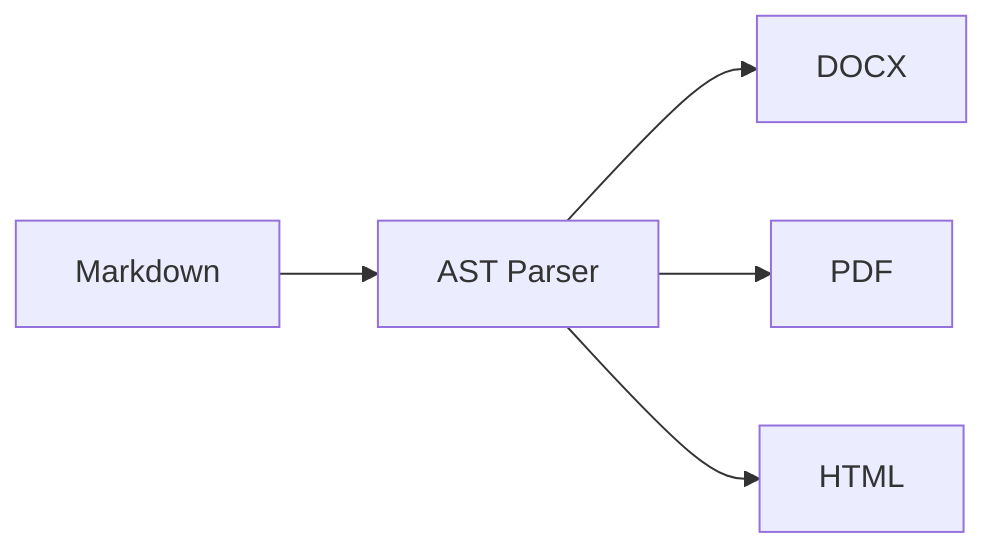

import { Card, CardGrid, Badge } from '@astrojs/starlight/components';

**MarkForge** is a high-performance Markdown & MDX document publishing engine and CLI. It converts a single Markdown source into pixel-perfect **Microsoft Word (DOCX)**, **PDF**, and **standalone HTML** — with Mermaid diagrams, GitHub-style callout boxes, dual-theme syntax highlighting, image inlining, and a beautiful Ink terminal UI.

<CardGrid>
  <Card title="📄 Multi-Format Output" icon="document">
    Generate `.docx`, `.pdf`, and `.html` simultaneously from a single Markdown source.
  </Card>
  <Card title="🎨 Mermaid Diagrams" icon="seti:graphql">
    Flowcharts, sequence diagrams, gantt charts, and class diagrams — rendered and embedded in all formats.
  </Card>
  <Card title="📢 Callout / Alert Boxes" icon="warning">
    GitHub-style `> [!NOTE]`, `> [!TIP]`, `> [!WARNING]`, `> [!CAUTION]`, `> [!IMPORTANT]` with full color styling.
  </Card>
  <Card title="🌈 Dual Syntax Highlighting" icon="seti:typescript">
    Dark theme for PDF/HTML, Light theme for DOCX — automatically selected per format.
  </Card>
  <Card title="🖼️ Image Inlining Engine" icon="seti:image">
    Resolves local paths, remote URLs (auto-fetched), Base64 data URIs, and SVG vectors.
  </Card>
  <Card title="📐 Header & Footer Zones" icon="information">
    Left / Center / Right multi-zone headers and footers with `{title}`, `{page}`, `{pages}` tokens.
  </Card>
</CardGrid>

---

## Supported Markdown Elements

| Element | DOCX | PDF | HTML |
| :--- | :---: | :---: | :---: |
| Headings H1–H6 | ✅ | ✅ | ✅ |
| Paragraphs & inline formatting | ✅ | ✅ | ✅ |
| GFM Tables | ✅ | ✅ | ✅ |
| Ordered & unordered lists | ✅ | ✅ | ✅ |
| Checklists (`- [x]`) | ✅ | ✅ | ✅ |
| Blockquotes | ✅ | ✅ | ✅ |
| **Callout / Alert Boxes** | ✅ | ✅ | ✅ |
| Code blocks (syntax highlighted) | ✅ | ✅ | ✅ |
| Inline code | ✅ | ✅ | ✅ |
| **Mermaid Diagrams** | ✅ | ✅ | ✅ |
| Images (local / URL / Base64) | ✅ | ✅ | ✅ |
| Horizontal rules | ✅ | ✅ | ✅ |
| Bold, italic, strikethrough | ✅ | ✅ | ✅ |
| Auto Table of Contents | ✅ | ✅ | ✅ |
| **Header & Footer (multi-zone)** | ✅ | ✅ | — |
| Embedded `<style>` / HTML | — | ✅ | ✅ |
| **Watermark** | ✅ | ✅ | — |

---

## Built-in Themes

| Theme | Description |
| :--- | :--- |
| `default` | Blu by BCA Digital cyan palette, modern sans-serif |
| `academic` | Serif typography (Merriweather), justified text for formal papers |
| `github` | GitHub Markdown rendering style |
| `corporate` | Clean professional layout |
| `minimal` | Minimal whitespace-focused design |
| `dracula` | Dark-mode inspired color scheme |

All themes inherit a shared **`THEME_COMPONENTS`** base layer that provides consistent callout boxes, code blocks, tables, and TOC styles — so switching themes never breaks component styling.

---

## Quick Example

```bash
markforge spec.md --to docx,pdf,html --theme academic -o ./dist
```

```markdown
---
title: "Enterprise System Specification"
author: "Ma'sum"
version: "2.4.0"
theme: "default"
toc: true
header:
  left: "My Company"
  right: "{title}"
footer:
  right: "Page {page} of {pages}"
---

# System Architecture

> [!NOTE]
> All builders run concurrently. Assets are resolved once and cached.

## Flowchart


