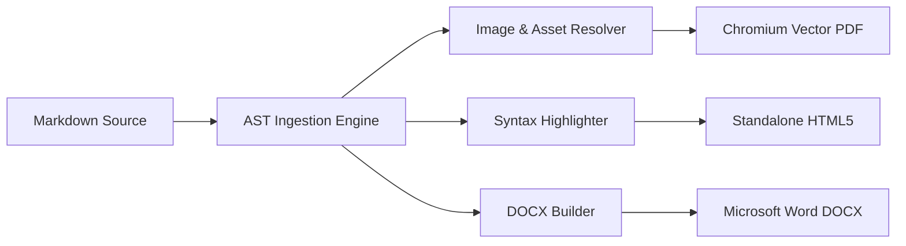

import { Tabs, TabItem, Aside } from '@astrojs/starlight/components';

## CLI Commands

### Basic Compilation

```bash
# Compile to DOCX + PDF (default formats)
markforge document.md

# Specify target output formats and destination directory
markforge specification.md --to docx,pdf,html --output ./dist

# Use a theme with custom CSS overlay
markforge report.md --theme corporate --css ./styles/custom.css

# Force Table of Contents + watch mode
markforge guide.md --toc --watch

# Start local HTTP preview server on port 4000
markforge document.md --serve --port 4000 --open
```

---

## Complete CLI Options Reference

| Flag | Alias | Description | Default |
| :--- | :---: | :--- | :--- |
| `<file>` | | Markdown input file path | **Required** |
| `--to <formats...>` | `-t` | Comma-separated: `docx`, `pdf`, `html`, `png` | `docx,pdf` |
| `--output <dir>` | `-o` | Target directory for generated files | Input file directory |
| `--config <file>` | `-c` | Explicit configuration file path | Auto-detected |
| `--theme <name>` | | Built-in theme (`corporate`, `default`) | `corporate` |
| `--css <files...>` | | Custom CSS file(s) to inject | `undefined` |
| `--orientation <type>` | | Page orientation (`portrait`, `landscape`) | `portrait` |
| `--paper-size <size>` | | Standard paper size (`A4`, `Letter`, `Legal`, `A3`, `A5`) | `A4` |
| `--toc` | | Force Table of Contents generation | `false` |
| `--watermark <text>` | | Document watermark text | `undefined` |
| `--syntax-theme <theme>`| | Code syntax highlighting theme | `github-dark` |
| `--watch` | `-w` | Watch input file and recompile on change | `false` |
| `--serve` | | Start local HTTP preview server | `false` |
| `--port <number>` | `-p` | Local preview server port | `4000` |
| `--open` | | Automatically open browser on preview | `false` |
| `--version` | `-V` | Print version and exit | |
| `--help` | `-h` | Show help screen | |

---

## Frontmatter Reference

Frontmatter inside the Markdown file overrides configuration file settings for that specific document:

```markdown
---
title: "Enterprise Architecture Specification"
subtitle: "Cloud & Edge Infrastructure — Q3 2026"
author: "Masum RPG"
company: "Masum Dev Technologies"
version: "1.0.0"
date: "2026-08-29"
theme: "corporate"
toc: true
orientation: "portrait"
paperSize: "A4"
margins:
  top: "3cm"
  bottom: "2.5cm"
  left: "2.5cm"
  right: "2.5cm"
watermark:
  text: "CONFIDENTIAL DRAFT"
  color: "#E11D48"
  opacity: 0.1
  fontSize: 52
  rotate: -45
  position: "diagonal"
header:
  left:
    text: "{company} - {title}"
    color: "#0D998D"
    fontSize: 9
    bold: true
  center: "Internal Technical Guide"
  right:
    text: "v{version}"
    color: "#94A3B8"
    fontSize: 8.5
    italic: true
  divider: true
  dividerColor: "#CBD5E1"
footer:
  left:
    text: "Author: {author}"
    color: "#64748B"
    fontSize: 8.5
  center: "{date}"
  right:
    text: "Page {page} of {pages}"
    color: "#0D998D"
    fontSize: 9
    bold: true
  divider: true
  dividerColor: "#CBD5E1"
---
```

---

## Callout / Alert Boxes

MarkForge renders GitHub-flavored callout syntax with colored backgrounds and borders in **all output formats** (DOCX, PDF, HTML):

```markdown
> [!NOTE]
> All document builders operate concurrently. Assets are resolved once and cached.

> [!TIP]
> Use `markforge.config.ts` to enforce uniform margins, page numbering, and corporate branding.

> [!IMPORTANT]
> External images from remote URLs are automatically fetched with exponential backoff retry and inlined as Base64.

> [!WARNING]
> Ensure all local relative file paths are relative to the root Markdown entry file.

> [!CAUTION]
> High-risk action — modifying OpenXML schemas directly without validation may corrupt Word documents.
```

| Type | Border Color | Background |
| :--- | :--- | :--- |
| `NOTE` | Cyan `#33CDCF` | `#ECFDFD` |
| `TIP` | Green `#10b981` | `#ecfdf5` |
| `IMPORTANT` | Purple `#8b5cf6` | `#f5f3ff` |
| `WARNING` | Amber `#f59e0b` | `#fffbeb` |
| `CAUTION` | Red `#ef4444` | `#fef2f2` |

---

## Mermaid Diagrams

Mermaid code blocks are automatically rendered into rasterized diagrams and embedded across all formats:

````markdown

````

---

## Syntax-Highlighted Code Blocks

MarkForge includes built-in syntax highlighting palettes: `github-dark`, `github-light`, `dracula`, `monokai`, and `nord`:

````markdown
```typescript
import { compileMarkdown, OutputFormat, Theme } from "@masumdev/markforge";

const result = await compileMarkdown("./spec.md", {
  to: [OutputFormat.DOCX, OutputFormat.PDF, OutputFormat.HTML],
  theme: Theme.CORPORATE,
});
```
````

---

## Programmatic API

<Tabs>
  <TabItem label="High-Level (compileMarkdown)">
    ```typescript
    import {
      compileMarkdown,
      OutputFormat,
      Theme,
      Orientation,
      PaperSizeEnum,
      WatermarkPosition,
    } from "@masumdev/markforge";

    const result = await compileMarkdown("./specification.md", {
      to: [OutputFormat.DOCX, OutputFormat.PDF, OutputFormat.HTML],
      outputDir: "./dist",
      theme: Theme.CORPORATE,
      orientation: Orientation.PORTRAIT,
      paperSize: PaperSizeEnum.A4,
      toc: true,
      watermark: {
        text: "CONFIDENTIAL",
        color: "#E11D48",
        opacity: 0.08,
        position: WatermarkPosition.DIAGONAL,
      },
      metadata: {
        title: "Platform Reference Manual",
        author: "Masum RPG",
        company: "Masum Dev Technologies",
        version: "1.0.0",
      },
    }, (statusMessage) => {
      console.log(`[PROGRESS] ${statusMessage}`);
    });

    console.log(`✓ Compiled ${result.files.length} documents in ${result.durationMs}ms`);
    for (const file of result.files) {
      console.log(`  [${file.format.toUpperCase()}] ${file.filePath} (${file.sizeBytes} bytes)`);
    }
    ```
  </TabItem>
  <TabItem label="Low-Level (AST & Builders)">
    ```typescript
    import * as fs from "node:fs";
    import {
      parseMarkdownDocument,
      buildDocxDocument,
      buildPdfDocument,
      buildHtmlDocument,
      Theme,
    } from "@masumdev/markforge";

    // 1. Read and parse Markdown into AST
    const rawMarkdown = fs.readFileSync("./report.md", "utf-8");
    const doc = parseMarkdownDocument(rawMarkdown);

    const config = {
      theme: Theme.CORPORATE,
      toc: true,
      margins: { top: "2.5cm", bottom: "2.5cm", left: "2.5cm", right: "2.5cm" },
    };

    // 2. Build formats independently
    const docxBuffer = await buildDocxDocument(doc, config);
    const pdfBuffer  = await buildPdfDocument(doc, config);
    const htmlString = await buildHtmlDocument(doc, config);

    // 3. Save files
    fs.writeFileSync("./dist/report.docx", docxBuffer);
    fs.writeFileSync("./dist/report.pdf", pdfBuffer);
    fs.writeFileSync("./dist/report.html", htmlString, "utf-8");
    ```
  </TabItem>
</Tabs>
