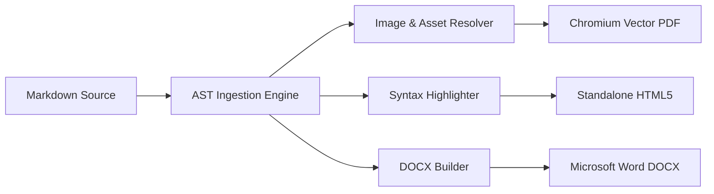
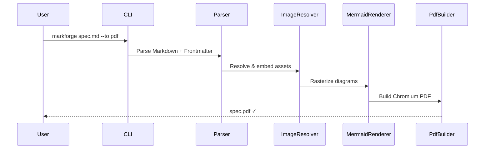

import { Tabs, TabItem, Aside } from '@astrojs/starlight/components';

## CLI Commands

### Basic Compilation

```bash
# Compile to DOCX + PDF (default formats)
markforge document.md

# Specify output formats and directory
markforge specification.md --to docx,pdf,html --output ./dist

# Use a built-in theme with custom CSS overlay
markforge report.md --theme academic --css ./styles/custom.css

# Force Table of Contents + watch mode
markforge guide.md --toc --watch
```

---

## CLI Options Reference

| Flag | Alias | Description | Default |
| :--- | :---: | :--- | :--- |
| `--to <formats>` | `-t` | Comma-separated: `docx`, `pdf`, `html` | `docx,pdf` |
| `--output <dir>` | `-o` | Target directory for generated files | Same as input |
| `--theme <name>` | | Built-in theme (`default`, `academic`, `github`, `corporate`, `minimal`, `dracula`) | `default` |
| `--css <path...>` | | Custom CSS file(s) to inject | |
| `--toc` | | Force Table of Contents generation | `false` |
| `--config <path>` | `-c` | Config file path | Auto-detected |
| `--watch` | `-w` | Watch input file and recompile on change | `false` |
| `--version` | `-V` | Print version and exit | |
| `--help` | `-h` | Show help screen | |

---

## Frontmatter Reference

```markdown
---
title: "Enterprise Architecture Specification"
subtitle: "Cloud & Edge Infrastructure — Q3 2026"
author: "Ma'sum"
version: "2.4.0"
date: "2026-08-27"
theme: "default"          # default | academic | github | corporate | minimal | dracula
toc: true                 # auto-generate Table of Contents
orientation: "portrait"   # portrait | landscape
paperSize: "A4"           # A4 | letter | legal
watermark:
  enabled: false          # no watermark by default
  text: "CONFIDENTIAL"
  opacity: 0.08
  position: "diagonal"    # diagonal | center | top-left | top-right | bottom-left | bottom-right
header:
  left: "My Company"
  center: "{title}"
  right: "Version {version}"
footer:
  left: "Confidential - Internal Use Only"
  right: "Page {page} of {pages}"
---
```

---

## Callout / Alert Boxes

MarkForge renders GitHub-flavored callout syntax with colored backgrounds and borders in **all output formats** (DOCX, PDF, HTML):

```markdown
> [!NOTE]
> All document builders operate concurrently. Assets are resolved once and cached.

> [!TIP]
> Use `markforge.config.ts` to enforce uniform margins, page numbering, and corporate branding.

> [!IMPORTANT]
> External images from remote URLs are automatically fetched with exponential backoff retry and inlined as Base64.

> [!WARNING]
> Ensure all local relative file paths are relative to the root Markdown entry file.

> [!CAUTION]
> Modifying raw OpenXML schemas without the DOCX Builder validation layer can corrupt legacy Word viewers.
```

| Type | Border Color | Background |
| :--- | :--- | :--- |
| `NOTE` | Cyan `#33CDCF` | `#ECFDFD` |
| `TIP` | Green `#10b981` | `#ecfdf5` |
| `IMPORTANT` | Purple `#8b5cf6` | `#f5f3ff` |
| `WARNING` | Amber `#f59e0b` | `#fffbeb` |
| `CAUTION` | Red `#ef4444` | `#fef2f2` |

<Aside type="note">
Callout box colors are rendered using **inline `style` attributes** in the HTML output, which ensures they appear correctly in Chromium-rendered PDFs even without background-graphics enabled.
</Aside>

---

## Mermaid Diagrams

Mermaid code blocks are automatically rendered into rasterized images and embedded in all output formats:

````markdown

````

````markdown

````

<Aside type="tip">
For complex diagrams, MarkForge uses a `virtual-time-budget` of 8000ms in headless Chromium to ensure Mermaid.js fully renders before PDF capture.
</Aside>

---

## Syntax-Highlighted Code Blocks

All common languages are supported. MarkForge uses a **dual-theme** tokenizer:

- **PDF / HTML**: VS Code Dark+ palette — bright, high-contrast colors on dark `#0f172a` backgrounds
- **DOCX**: GitHub Light palette — deep, readable colors on white backgrounds

````markdown
```typescript
import { markforge } from "@masumdev/markforge";

const result = await markforge("./spec.md", {
  to: ["docx", "pdf", "html"],
  theme: "academic",
});
```

```python
def compile_docs(source: str) -> dict:
    """Compile a Markdown document via subprocess."""
    result = subprocess.run(["markforge", source], capture_output=True)
    return {"status": "SUCCESS", "logs": result.stdout}
```

```sql
SELECT id, document_title, duration_ms
FROM document_compilations
WHERE status = 'SUCCESS'
ORDER BY created_at DESC;
```
````

**Supported languages**: `typescript`, `javascript`, `tsx`, `jsx`, `python`, `bash`, `shell`, `sql`, and more.

---

## Image Inlining Engine

```markdown
<!-- Local relative image (embedded as Base64 in DOCX/PDF) -->


<!-- Remote URL (auto-fetched with exponential backoff retry) -->


<!-- Base64 Data URI (used as-is) -->


<!-- SVG vector (inlined as Base64) -->

```

---

## Embedded HTML & CSS

Inline HTML and `<style>` blocks are supported in PDF and HTML outputs:

```markdown
<style>
.metric-grid {
  display: grid;
  grid-template-columns: repeat(3, 1fr);
  gap: 16px;
  margin: 16px 0;
}
.metric-card {
  background: #f8fafc;
  border-left: 4px solid #33CDCF;
  padding: 1rem;
  border-radius: 6px;
  text-align: center;
}
</style>

<div class="metric-grid">
  <div class="metric-card"><strong>91ms</strong><br>Compilation Time</div>
  <div class="metric-card"><strong>100%</strong><br>Type Safety</div>
  <div class="metric-card"><strong>3 Formats</strong><br>DOCX | PDF | HTML</div>
</div>
```

---

## Programmatic API

<Tabs>
  <TabItem label="High-level">
    ```typescript
    import { markforge } from "@masumdev/markforge";

    const result = await markforge("./specification.md", {
      to: ["docx", "pdf", "html"],
      outputDir: "./dist",
      theme: "academic",
      metadata: {
        title: "System Architecture Specification",
        author: "Ma'sum",
        version: "2.4.0",
      },
    });

    console.log(`✓ ${result.files.length} files in ${result.durationMs}ms`);
    for (const f of result.files) {
      console.log(`  [${f.format.toUpperCase()}] ${f.filePath}`);
    }
    ```
  </TabItem>
  <TabItem label="Low-level">
    ```typescript
    import {
      compileMarkdown,
      buildPdfDocument,
      buildDocxDocument,
      buildHtmlDocument,
    } from "@masumdev/markforge";

    // Parse once — build each format independently
    const { doc, config, baseDir } = await compileMarkdown("./report.md");

    const pdf  = await buildPdfDocument(doc, config, baseDir);
    const docx = await buildDocxDocument(doc, config, baseDir);
    const html = await buildHtmlDocument(doc, config, baseDir);

    // Use buffers/strings directly
    await Bun.write("./dist/report.pdf", pdf);
    await Bun.write("./dist/report.docx", docx);
    await Bun.write("./dist/report.html", html);
    ```
  </TabItem>
</Tabs>
