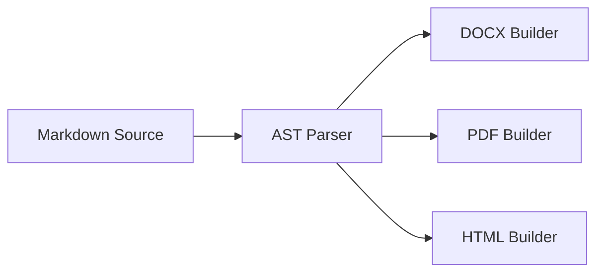

<div align="center">

# @masumdev/markforge

**Modern, high-performance Markdown & MDX multi-format publishing engine & CLI.**  
Convert Markdown into pixel-perfect **DOCX**, **PDF**, and **HTML** with syntax highlighting, Mermaid diagrams, callout boxes, and a beautiful Ink terminal UI.

[](https://www.npmjs.com/package/@masumdev/markforge)
[](https://opensource.org/licenses/MIT)
[](https://www.typescriptlang.org/)
[](https://bun.sh)

</div>

---

## ✨ Features

| Feature | Description |
| :--- | :--- |
| 📄 **Multi-Format Output** | Generate `.docx`, `.pdf`, and `.html` from a single Markdown source |
| 🎨 **Mermaid Diagrams** | Full Mermaid.js support — flowcharts, sequence, gantt, class diagrams |
| 📢 **Callout / Alert Boxes** | GitHub-style `> [!NOTE]`, `> [!TIP]`, `> [!WARNING]`, `> [!CAUTION]`, `> [!IMPORTANT]` |
| 🌈 **Dual Syntax Highlighting** | Dark theme for PDF/HTML, Light theme for DOCX — 100% readable in both |
| 🖼️ **Image Inlining Engine** | Auto-resolves local paths, remote URLs, Base64 URIs, and SVGs |
| 📑 **Auto Table of Contents** | Anchored TOC generated from heading structure |
| 📐 **Header & Footer Zones** | Left / Center / Right multi-zone headers and footers per format |
| 🎨 **Curated Themes** | `default`, `academic`, `github`, `corporate`, `minimal`, `dracula` |
| 💧 **Watermark Support** | Optional configurable watermark (position, opacity, text) — off by default |
| ⚙️ **Type-Safe Config** | `markforge.config.ts`, `.markforgerc.json`, or YAML with JSON Schema |
| 🚀 **Programmatic API** | Full TypeScript API for Node.js & Bun integration |
| 🖥️ **Ink Terminal UI** | Rich interactive TUI with progress indicators and build summary |

---

## 📦 Installation

```bash
# Global CLI
npm install -g @masumdev/markforge
bun add -g @masumdev/markforge

# Dev dependency
npm install -D @masumdev/markforge
bun add -d @masumdev/markforge
```

---

## 🚀 Quick Start

```bash
# Convert to DOCX + PDF (default)
markforge document.md

# Specify output formats
markforge document.md --to docx,pdf,html -o ./dist

# Use a theme and custom CSS
markforge report.md --theme academic --css ./styles/corp.css

# Force Table of Contents
markforge specification.md --toc

# Watch mode
markforge document.md --watch
```

---

## 🖊️ Markdown Source Features

### Callout / Alert Boxes

MarkForge supports GitHub-style alert syntax with full color-coded styling in all output formats:

```markdown
> [!NOTE]
> This is a note — rendered with cyan left border.

> [!TIP]
> This is a tip — rendered with green styling.

> [!IMPORTANT]
> Critical information — rendered with purple styling.

> [!WARNING]
> A warning — rendered with amber/yellow styling.

> [!CAUTION]
> High-risk action — rendered with red styling.
```

### Mermaid Diagrams

Mermaid code blocks are automatically rendered into images embedded in all output formats:

````markdown

````

### Syntax-Highlighted Code Blocks

All common languages are supported with proper token coloring:

````markdown
```typescript
import { markforge } from "@masumdev/markforge";

const result = await markforge("./spec.md", { to: ["pdf", "docx"] });
```
````

**Dual-theme coloring:**
- **PDF / HTML**: VS Code Dark+ palette (bright colors on dark background)
- **DOCX**: GitHub Light palette (deep colors on white background)

### Table of Contents

Add `toc: true` in frontmatter or use `--toc` CLI flag to auto-generate:

```markdown
---
toc: true
---

# My Document
```

---

## 📋 Frontmatter Reference

```markdown
---
title: "Enterprise Architecture Specification"
subtitle: "Cloud & Edge Infrastructure — Q3 2026"
author: "Ma'sum"
version: "2.4.0"
date: "2026-08-27"
theme: "default"          # default | academic | github | corporate | minimal | dracula
toc: true                 # auto-generate Table of Contents
orientation: "portrait"   # portrait | landscape
paperSize: "A4"           # A4 | letter | legal
watermark:
  enabled: false          # no watermark by default
  text: "CONFIDENTIAL"
  opacity: 0.08
  position: "diagonal"    # diagonal | center | top-left | top-right | bottom-left | bottom-right
header:
  left: "My Company"
  center: "{title}"
  right: "Version {version}"
footer:
  left: "Confidential"
  right: "Page {page} of {pages}"
---
```

---

## ⚙️ Configuration Reference

MarkForge automatically discovers configuration files starting from the input file's directory up to the workspace root, or via the `-c, --config <path>` CLI flag.

### 1. TypeScript (`markforge.config.ts`)

```typescript
import { defineConfig } from "@masumdev/markforge";

export default defineConfig({
  // Output formats: "docx" | "pdf" | "html"
  to: ["docx", "pdf", "html"],
  outputDir: "./dist/documents",

  // Theme: "default" | "academic" | "github" | "corporate" | "minimal" | "dracula"
  theme: "academic",

  // Custom CSS stylesheet(s) to inject
  css: ["./styles/custom.css"],

  // Page layout & dimensions
  orientation: "portrait", // "portrait" | "landscape"
  paperSize: "A4",         // "A4" | "Letter" | "Legal" | "A3" | "A5"
  margins: {
    top: "2.5cm",
    bottom: "2.5cm",
    left: "3cm",
    right: "3cm",
  },

  // Multi-zone header & footer (supports tokens: {title}, {author}, {version}, {date}, {page}, {pages})
  header: {
    left: "Enterprise Architecture",
    center: "{title}",
    right: "v{version}",
  },
  footer: {
    left: "Confidential — Internal Use Only",
    right: "Page {page} of {pages}",
  },

  // Document features
  toc: true,                 // Auto-generate Table of Contents
  embedImages: true,         // Embed/inline all images as Base64 data URIs
  bundleHtml: true,          // Self-contained HTML with embedded styles and scripts
  syntaxTheme: "github-dark", // "github-dark" | "github-light" | "dracula" | "monokai" | "nord"

  // Diagonal page watermark
  watermark: "CONFIDENTIAL",

  // Default document metadata
  metadata: {
    title: "System Architecture Specification",
    author: "Ma'sum",
    version: "1.0.0",
    company: "My Organization",
  },

  // Server & watch options
  watch: false,
  serve: false,
  port: 4000,
  open: false,
});
```

### 2. JSON with `$schema` (`markforge.config.json`)

Adding `$schema` enables **instant autocompletion and validation** in VS Code, WebStorm, and other IDEs:

```json
{
  "$schema": "https://raw.githubusercontent.com/masumdev/react-native-library/main/packages/markforge/schema.json",
  "to": ["docx", "pdf", "html"],
  "outputDir": "./dist/documents",
  "theme": "academic",
  "orientation": "portrait",
  "paperSize": "A4",
  "margins": {
    "top": "2.5cm",
    "bottom": "2.5cm",
    "left": "3cm",
    "right": "3cm"
  },
  "header": {
    "left": "Enterprise Architecture",
    "right": "{title}"
  },
  "footer": {
    "left": "Confidential",
    "right": "Page {page} of {pages}"
  },
  "toc": true,
  "embedImages": true,
  "syntaxTheme": "github-dark",
  "watermark": "CONFIDENTIAL"
}
```

### 3. YAML (`markforge.config.yaml` / `.markforgerc.yaml`)

```yaml
to:
  - docx
  - pdf
  - html
outputDir: ./dist/documents
theme: academic
orientation: portrait
paperSize: A4
margins:
  top: 2.5cm
  bottom: 2.5cm
  left: 3cm
  right: 3cm
header:
  left: Enterprise Architecture
  right: "{title}"
footer:
  left: Confidential
  right: "Page {page} of {pages}"
toc: true
embedImages: true
watermark: CONFIDENTIAL
```


---

## 💻 Programmatic API

```typescript
import { markforge, compileMarkdown } from "@masumdev/markforge";

// High-level: compile file → write to disk
const result = await markforge("./specification.md", {
  to: ["docx", "pdf", "html"],
  outputDir: "./dist",
  theme: "academic",
  metadata: {
    title: "System Architecture Specification",
    author: "Ma'sum",
    version: "2.4.0",
  },
});

console.log(`✓ Generated ${result.files.length} files in ${result.durationMs}ms`);

for (const file of result.files) {
  console.log(`  [${file.format.toUpperCase()}] ${file.filePath} — ${file.sizeBytes} bytes`);
}
```

```typescript
import { compileMarkdown, buildPdfDocument, buildDocxDocument, buildHtmlDocument } from "@masumdev/markforge";

// Low-level: parse → build each format independently
const parsed = await compileMarkdown("./report.md");

const pdfBuffer   = await buildPdfDocument(parsed.doc, parsed.config, parsed.baseDir);
const docxBuffer  = await buildDocxDocument(parsed.doc, parsed.config, parsed.baseDir);
const htmlString  = await buildHtmlDocument(parsed.doc, parsed.config, parsed.baseDir);
```

---

## 🎨 Built-in Themes

| Theme | Description | Best For |
| :--- | :--- | :--- |
| `default` | Blu by BCA Digital cyan palette, modern sans-serif | Tech docs, specifications |
| `academic` | Serif typography (Merriweather/Georgia), justified text | Papers, reports, theses |
| `github` | GitHub Markdown rendering style | READMEs, open-source docs |
| `corporate` | Clean professional layout | Business documents |
| `minimal` | Minimal whitespace-focused design | Simple notes |
| `dracula` | Dark-mode inspired color scheme | Developer docs |

All themes automatically inherit shared component styles (callouts, code blocks, tables, badges) via the `THEME_COMPONENTS` base layer.

---

## 🖥️ CLI Flags

| Flag | Alias | Description | Default |
| :--- | :---: | :--- | :--- |
| `--to <formats>` | `-t` | Comma-separated output formats: `docx`, `pdf`, `html` | `docx,pdf` |
| `--output <dir>` | `-o` | Output directory | Same as input file dir |
| `--theme <name>` | | Built-in theme name | `default` |
| `--css <path...>` | | Custom CSS file(s) to inject | |
| `--toc` | | Force Table of Contents generation | `false` |
| `--config <path>` | `-c` | Config file path (`markforge.config.ts`, `.json`, `.yaml`) | Auto-discovered |
| `--watch` | `-w` | Watch input and re-compile on change | `false` |
| `--version` | `-V` | Print version and exit | |
| `--help` | `-h` | Show help | |

---

## 🏗️ Architecture

```
Markdown / MDX source
         │
         ▼
  ┌─────────────┐
  │  AST Parser  │  → Frontmatter + Node tree
  └──────┬──────┘
         │
   ┌─────┼─────┐
   │     │     │
   ▼     ▼     ▼
 DOCX   PDF   HTML
Builder Builder Builder
   │     │     │
   │  Chromium │
   │  (headless│
   │   PDF)    │
   ▼     ▼     ▼
 .docx  .pdf  .html
```

**Sub-systems:**
- `imageResolver` — Local / URL / Base64 / SVG asset resolution
- `mermaidRenderer` — Headless Mermaid.js diagram rasterization
- `syntaxHighlighter` — Dual dark/light theme tokenizer (no external deps)
- `htmlThemes` — `THEME_COMPONENTS` base + per-theme typography overrides

---

## 📄 License

MIT © [Ma'sum](https://github.com/masumrpg)
